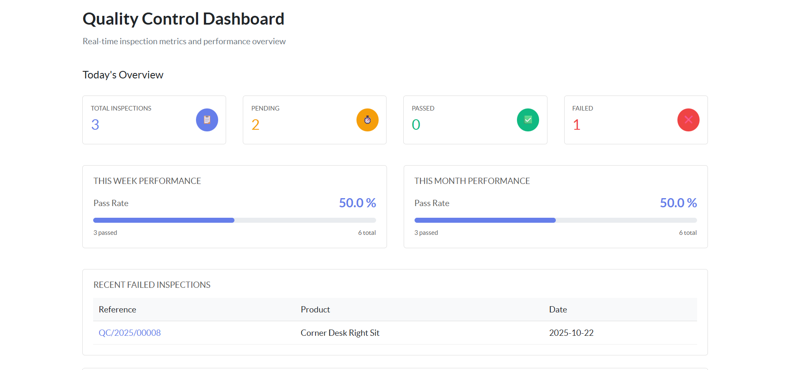
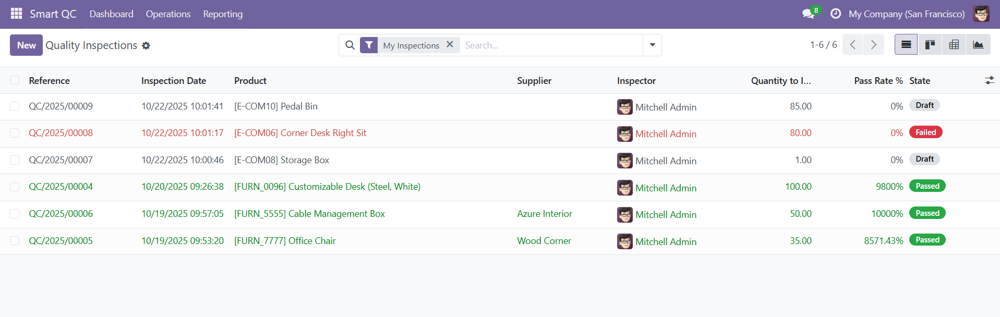
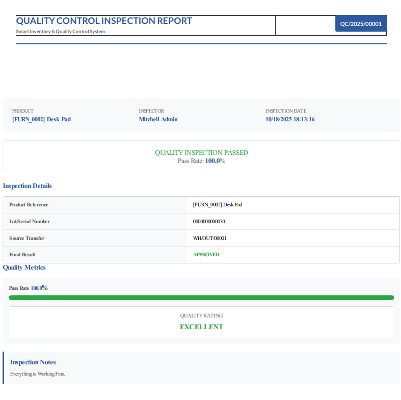

# Smart Inventory & Quality Control System


I built a practical Odoo module to integrate quality control inspections directly into the inventory workflow. Instead of dealing with paper forms and manual tracking, everything happens right inside Odoo, where your stock operations already live.

## Why I Built This

During my time working with inventory systems, I kept seeing the same pain points:

- Quality checks are getting skipped during busy receiving periods
- No clear paper trail when products failed inspection
- Frustrated warehouse teams juggling multiple systems
- Management asking "which supplier keeps sending us bad parts?" with no easy way to answer

So I built this module to fix those headaches. It automatically creates quality inspections when goods arrive, keeps everything documented, and gives you actual insights into quality trends.

## What It Does

### Automatic Quality Checks

When products arrive at your warehouse, the system automatically creates a quality inspection. No one needs to remember to do it - it just happens. Your warehouse team sees a simple button on their transfer screen: "Create QC Inspection." One click and they're filling out the inspection.

### Professional Documentation

Every inspection generates a clean PDF report. Perfect for:

- Sending to suppliers when rejecting shipments
- Keeping auditors happy
- Building a history for recurring quality issues

### Analytics That Actually Help

I included pivot tables and graphs so you can quickly answer questions like:

- "Which products fail inspection most often?"
- "Is our new supplier better than the old one?"
- "Are we seeing more quality issues this quarter?"


_Real-time dashboard showing quality metrics across products and suppliers_

## Key Features I Implemented

**Smart Automation**

- Background job runs hourly to create inspections for incoming transfers
- Status workflow: Draft → In Progress → Pass/Fail
- Auto-generated inspection numbers (QC/2025/0001, QC/2025/0002, etc.)

**Stock Transfer Integration**

- Added smart buttons directly on stock picking forms
- One-click inspection creation with pre-filled product data
- Links back to original transfer for full traceability

**Professional Reporting**

- Custom QWeb PDF templates with clean formatting
- Includes lot/serial numbers, timestamps, and inspector notes
- Ready to share with suppliers or compliance teams


_List view with color-coded status badges for quick visual scanning_

**Analytics Views**

- Pivot tables to slice quality data any way you need
- Graph views for trend analysis
- Filterable by date, product, supplier, lot number


_Professional PDF report generated from each inspection_

## Technical Implementation

Built this using core Odoo development patterns:

**Backend (Python/ORM)**

- Custom models with proper inheritance from `stock.picking`
- Implemented state management with selection fields and workflow methods
- Added computed fields for inspection counts on transfers
- Created scheduled actions using Odoo's cron system

**Frontend (XML/QWeb)**

- Extended existing inventory views with xpath modifications
- Built custom tree, form, and pivot views
- Designed QWeb report templates with conditional rendering
- Added stat buttons for at-a-glance metrics

**Business Logic**

- Validation rules to prevent duplicate inspections
- Smart defaults that reduce data entry
- Access rights configured for quality team vs warehouse team

## Installation

```bash
# Clone into your Odoo addons directory
cd /path/to/odoo/addons
git clone https://github.com/shadinbyte/smart-inventory-qc.git

# Install the module
./odoo-bin -d your_database -i smart_inventory_qc

# Or install via Odoo UI
# Apps → Update Apps List → Search "Smart QC" → Install
```

**Requirements:**

- Odoo 18.0 Community Edition
- Python 3.10+
- PostgreSQL
- Stock/Inventory module enabled

## How to Use

**Quick Start:**

1. Go to Inventory → Transfers
2. Open any incoming shipment
3. Click "Create QC Inspection" button
4. Fill in inspection results
5. Mark as Pass or Fail
6. Print report if needed

**Automated Mode:**
The system automatically creates inspections for new receipts every hour. Your team just needs to complete them.

**Analytics:**
Navigate to Smart QC → Analysis to view quality metrics in pivot/graph format.

## Module Structure

```
smart_inventory_qc/
├── __init__.py
├── __manifest__.py
├── models/
│   ├── __init__.py
│   ├── qc_inspection.py       # Core inspection model
│   └── stock_extension.py     # Stock picking integration
├── views/
│   ├── qc_inspection_views.xml
│   ├── stock_views.xml
│   └── dashboard_views.xml
├── report/
│   ├── qc_report_templates.xml
│   └── __init__.py
├── data/
│   └── automation_cron.xml    # Scheduled automation
├── security/
│   └── ir.model.access.csv
└── static/
    └── description/
        └── icon.png
```

## Skills Demonstrated

Working on this project gave me hands-on experience with:

- **Odoo Framework**: Models, views, security, and ORM operations
- **Python**: Object-oriented design, inheritance, and business logic
- **XML/QWeb**: View customization and PDF report generation
- **Database Design**: Relational data modeling with PostgreSQL
- **Workflow Automation**: Scheduled jobs and action triggers
- **UI/UX**: Creating intuitive interfaces for non-technical users

## Future Enhancements

Ideas I'm considering for v2:

- Email notifications when inspections fail
- Photo upload for visual inspection records
- Mobile app for warehouse floor inspections
- Integration with purchase orders for supplier ratings
- Checklist templates for different product categories

## Contributing

This is a portfolio project, but I'm open to suggestions! Feel free to open an issue or reach out if you see ways to improve it or have ideas for features.

## License

Licensed under LGPL-3.0 - same as Odoo Community Edition.

---
