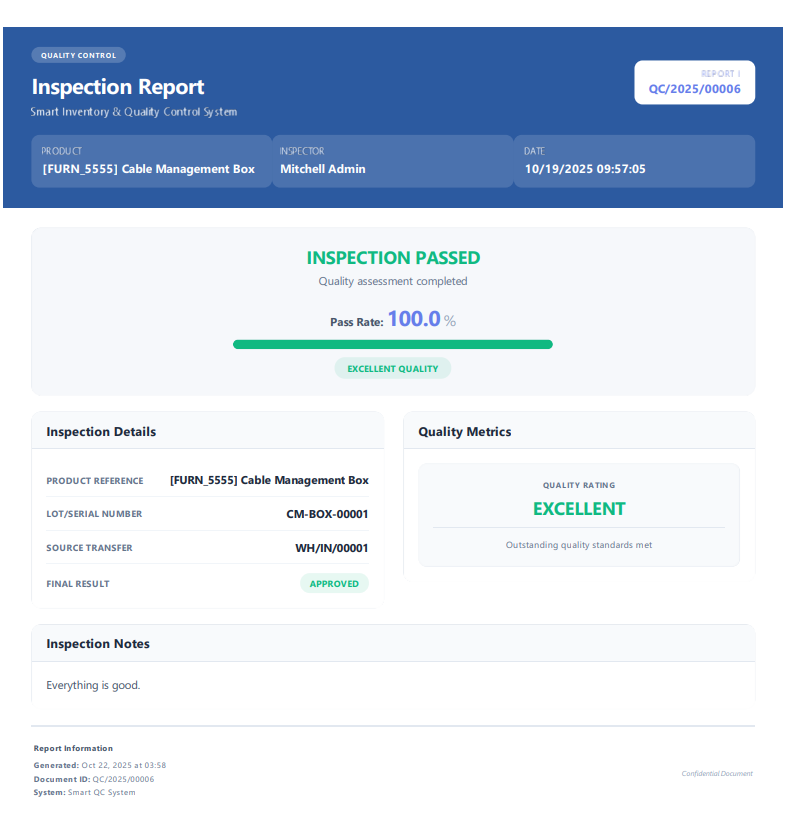

# Smart Inventory & Quality Control System


A production-ready Odoo 18 module that brings automated quality control directly into your inventory workflow. Built to solve real warehouse problems I've seen firsthand - where quality checks get forgotten, paperwork disappears, and nobody knows which suppliers are sending bad products.

---

## 💡 The Problem This Solves

Working with inventory systems, I kept seeing the same issues:

- **Quality checks getting skipped** during busy receiving periods because they're manual
- **No paper trail** when you need to prove a product failed inspection
- **Warehouse staff frustrated** jumping between clipboards, spreadsheets, and Odoo
- **Management asking** "Which supplier keeps sending us defects?" with no way to answer

This module automates the entire QC process right where it happens - in your stock transfers. No more separate systems, no more lost paperwork.

---

## ✨ What It Does

### Automated Quality Inspections

The system automatically creates quality inspections when goods arrive at your warehouse. Your receiving team sees a simple "Create QC" button right on the transfer screen. One click, and they're logging inspection results.

**Smart automation:**

- Background job runs hourly to create inspections for new receipts
- System blocks transfer validation until QC passes
- Auto-generates inspection numbers (QC/2025/00001, QC/2025/00002...)
- Links everything back to transfers, lots, and suppliers

### Complete Quality Tracking

Every inspection is fully documented with:

- Quantity-based tracking (how many inspected, accepted, rejected)
- Automatic pass rate calculations
- Quality ratings (Excellent/Good/Fair/Poor)
- Inspector assignments and timestamps
- Custom checklists for detailed multi-point inspections
- Full audit trail with chatter integration


_List view with color-coded status badges - green for passed, red for failed, yellow for in-progress_

### Real-Time Dashboard

A clean, simple dashboard shows you what matters:

- Today's inspection counts (total, pending, passed, failed)
- This week's pass rate with progress bars
- This month's quality trends
- Recent failed inspections with direct links
- One-click access to pending or failed inspections


_Real-time metrics updated as inspections are completed throughout the day_

### Professional PDF Reports

Generate clean, business-ready reports with one click:

- Pass/fail status with visual indicators
- Complete inspection details and metrics
- Quality ratings and pass rate percentages
- Ready to send to suppliers or keep for audits
- Professional formatting that looks good on paper


_Auto-generated PDF report with your design - professional enough for supplier communications_

### Analytics That Help You Decide

Built-in pivot tables and graphs let you answer questions like:

- Which products fail inspection most often?
- Is our new supplier better than the old one?
- Are we seeing more quality issues this quarter?
- Which inspector has the highest rejection rate?

**No exports to Excel needed** - analyze directly in Odoo with filters by date, product, supplier, or inspector.

---

## 🎯 Real Business Value

**For Warehouse Teams:**

- No more forgotten quality checks
- Everything logged in one place (no spreadsheets!)
- Clear visual feedback on every transfer
- Mobile-friendly kanban view for the warehouse floor

**For Quality Managers:**

- Instant visibility into inspection status
- Track supplier quality over time
- Professional reports for disputes
- Email notifications when inspections fail

**For Management:**

- Data-driven supplier decisions
- Identify problem products early
- Compliance-ready audit trail
- Measure quality team performance

---

## 🛠 Technical Implementation

### What I Built

**Backend (Python/ORM):**

- Custom models with proper inheritance and relationships
- Business logic with validation constraints
- Automated workflows using scheduled actions
- Email notifications with QWeb templates
- Activity tracking for quality alerts
- Computed fields for real-time metrics

**Frontend (XML/Views):**

- List, Form, Kanban, Pivot, and Graph views
- Smart buttons on stock picking forms
- Dynamic decorations based on state
- Search filters with proper Odoo 18 syntax
- Dashboard with controller-based rendering

**Security & Access:**

- Role-based access control (Inspector vs Manager)
- Record rules for data isolation
- Inspectors see only their own inspections
- Managers have full access

**Integration:**

- Extends stock.picking without breaking anything
- Works with existing inventory workflows
- Integrates with mail system for notifications
- Proper sequence generation

---

## 📦 Installation

### Prerequisites

- Odoo 18.0 Community
- Python 3.10+
- PostgreSQL 15+

### Quick Setup

```bash
# Clone into your Odoo addons directory
cd /path/to/odoo/addons
git clone https://github.com/shadinbyte/smart_inventory_qc.git

# Restart Odoo
./odoo-bin -c /path/to/odoo.conf

# Install via UI
# Apps → Update Apps List → Search "Smart QC" → Install
```

**Dependencies:** All standard Odoo modules (`stock`, `product`, `mail`)

---

## 🚀 How to Use

### Creating Inspections

**From Stock Transfers (Easiest):**

1. Go to **Inventory → Operations → Transfers**
2. Open any incoming receipt
3. Click the **"Create QC"** button
4. System auto-fills product, quantity, and lot data
5. Start inspection and record results

**Automatic Creation:**

- System checks hourly for new incoming transfers
- Auto-creates inspections for products without QC
- Zero manual effort - just complete the inspections

### Running Inspections

1. Navigate to **Smart QC → Operations → Quality Inspections**
2. Open an inspection (or it opens automatically after creation)
3. Click **"Start Inspection"** to begin
4. Enter accepted and rejected quantities
5. Optionally add checklist items for detailed checks
6. Click **"Pass"** or **"Fail"**
7. Print PDF report if needed for supplier communication

### Using the Dashboard

Go to **Smart QC → Dashboard** to see:

- Real-time today's statistics
- Weekly and monthly pass rates
- Recent failed inspections (clickable to open details)
- Quick action buttons to filter inspections

### Viewing Analytics

Navigate to **Smart QC → Reporting** to access:

- **Quality Analysis**: Pivot tables and graphs by product, date, supplier
- **Supplier Quality**: Compare vendors side-by-side
- Use built-in filters to slice data any way you need

---

## 📁 Project Structure

```
smart_inventory_qc/
├── __manifest__.py              # Module configuration
├── controllers/
│   └── dashboard.py             # Dashboard route handler
├── models/
│   ├── qc_inspection.py         # Main inspection model + checklist
│   └── stock_extension.py       # Stock picking integration
├── views/
│   ├── qc_inspection_views.xml  # List, form, search, kanban views
│   ├── qc_dashboard_template.xml # Dashboard HTML template
│   ├── stock_views.xml          # Smart buttons on transfers
│   ├── dashboard_views.xml      # Pivot & graph analytics
│   └── menus.xml                # Navigation structure
├── data/
│   ├── sequence_data.xml        # Auto-numbering
│   ├── automation_cron.xml      # Scheduled jobs
│   └── mail_template.xml        # Email templates
├── report/
│   ├── qc_report_templates.xml  # Professional PDF report
│   └── qc_report_actions.xml    # Report definitions
└── security/
    ├── qc_security.xml          # Groups and record rules
    └── ir.model.access.csv      # Access rights matrix
```

---

## 💪 Skills Demonstrated

Building this module gave me hands-on experience with:

### Odoo Development

- Models, views, actions, and controllers
- ORM operations and complex queries
- Inheritance and extension patterns
- Automated actions and cron jobs
- QWeb templating for reports and dashboards

### Python Programming

- Object-oriented design
- Business logic implementation
- Data validation and constraints
- Exception handling and logging
- Date/time handling with timezone awareness

### Frontend Development

- XML view definitions
- Dynamic decorations and badges
- Search filters and domains
- Responsive dashboard layouts
- Professional report styling

### Database & Architecture

- PostgreSQL integration
- Relational data modeling
- Computed and stored fields
- SQL constraints
- Transaction safety

### Business Analysis

- Understanding warehouse workflows
- Translating business needs to features
- Creating intuitive user interfaces
- Solving real operational problems

---

## 🔄 Future Enhancements

Ideas for version 2:

- [ ] Photo upload for visual defect documentation
- [ ] Barcode scanner integration for mobile use
- [ ] QC template library for different product types
- [ ] Automated supplier quality scoring
- [ ] Advanced dashboard widgets (if Enterprise)
- [ ] Batch inspection wizard for high-volume operations
- [ ] Integration with purchase orders for vendor ratings

---

## 🎓 What I Learned

This project taught me:

1. **Real-world problem solving** - Not just coding features, but understanding why they matter
2. **Odoo best practices** - Proper inheritance, security, and workflow integration
3. **Production quality** - Validation, error handling, and user experience matter
4. **Business thinking** - Features are only useful if people actually use them
5. **Full-stack development** - From database design to PDF generation

The biggest lesson? **Keep it simple.** I went through several iterations making this too complex before realizing warehouse teams need something straightforward that just works.

---

## 🤝 For Hiring Managers

This project showcases my ability to:

- **Understand business problems** beyond just technical requirements
- **Design practical solutions** that people actually want to use
- **Write production-quality code** with proper validation and error handling
- **Create professional UIs** that don't require training
- **Think full-stack** from data model to user experience

If you're looking for an Odoo developer who can bridge business needs and technical implementation, I'd love to discuss how I can contribute to your team.

**Questions I can answer:**

- Walk through the code and explain design decisions
- Discuss how I'd extend this for your specific needs
- Demonstrate the module in action
- Explain tradeoffs I made and why

---

## 📄 License

Licensed under LGPL-3.0 - same as Odoo Community Edition.

---

⭐ **If this project helped you or you found it useful, please give it a star!**
